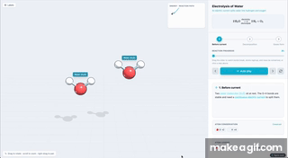

# Awesome Interactive 3D

A curated index of free, browser-based interactive STEM visualizers from
[Figviz Concepts](https://figviz.com/concepts). These resources help students
explore math, physics, and chemistry ideas by dragging controls, inspecting live
labels, and exporting visuals for slides or handouts.

## Contents

- [Math](#math)
- [Physics](#physics)
- [Chemistry](#chemistry)
- [Structured Data](#structured-data)

## Math

Interactive graphing and trigonometry tools for algebra, precalculus, and
foundational coordinate-plane reasoning.

- [Unit Circle](https://figviz.com/concepts/unit-circle) - Drag the angle to
  inspect sine, cosine, tangent, radians, degrees, exact coordinates, and common
  angles.
- [Slope-Intercept Form](https://figviz.com/concepts/slope-intercept-form) -
  Adjust `m` and `b` in `y = mx + b` to reshape a line and read slope,
  intercepts, and direction.
- [Quadratic Function](https://figviz.com/concepts/quadratic-function) - Change
  `a`, `b`, and `c` in `y = ax^2 + bx + c` to see how a parabola's vertex,
  roots, axis of symmetry, and discriminant update.
- [Exponential Function](https://figviz.com/concepts/exponential-function) -
  Compare growth and decay by dragging the initial value and base in
  `y = a*b^x`.
- [Systems of Equations](https://figviz.com/concepts/systems-of-equations) -
  Move two lines to identify one solution, no solution, or infinitely many
  solutions.

[See the Math category](categories/math.md)

## Physics

Motion and oscillation visualizers for connecting equations to changing
geometry over time.

- [Projectile Motion](https://figviz.com/concepts/projectile-motion) - Change
  launch angle and speed to study trajectory, range, maximum height, time of
  flight, and velocity components.
- [Simple Harmonic Motion](https://figviz.com/concepts/simple-harmonic-motion) -
  Adjust amplitude and period to connect sine-wave displacement, frequency, and
  angular frequency.

[See the Physics category](categories/physics.md)

## Chemistry

Molecular and reaction visualizers that show bonds, atom conservation, and
balanced equations.

- [Electrolysis of Water](https://figviz.com/concepts/electrolysis-of-water) -
  Step through `2 H2O -> 2 H2 + O2` and see water split into hydrogen and oxygen
  gas in 3D.
- [Combustion Reaction](https://figviz.com/concepts/combustion-reaction) -
  Watch methane burn as `CH4 + 2O2 -> CO2 + 2H2O`, with bonds breaking and
  reforming.
- [Balancing Chemical Equations](https://figviz.com/concepts/balancing-chemical-equations) -
  Adjust coefficients and watch atom counts balance on both sides of
  `H2 + O2 -> H2O`.

[See the Chemistry category](categories/chemistry.md)

## Structured Data

The same collection is available as machine-readable data in
[data/concepts.json](data/concepts.json). Each entry includes its subject,
learning level, teaching goal, primary URL, standalone interactive URL, public
export URLs, and related resources.

## Source

Content is organized from [https://figviz.com/concepts](https://figviz.com/concepts)
and the local Figviz concept registry. Public preview and export media use the
watermarked CDN URLs exposed by the Figviz concept pages.

## License

This repository is an index of external educational resources. Follow the terms
of the linked resources for usage of each interactive and exported asset.
